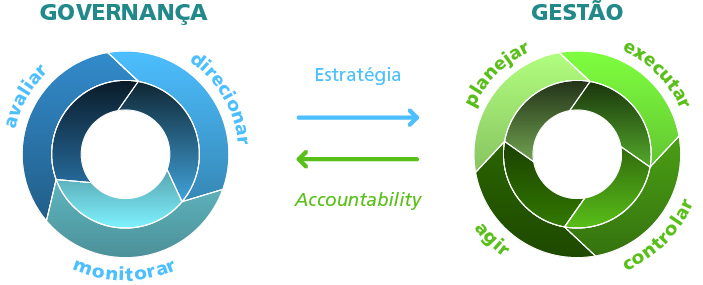

# Atividade 4: Leituras & Conceitos

## Descrição da atividade

Faça a leitura das referências sugeridas para esta semana, ou traga outras referências que julgar interessante. Fique à vontade.

O objetivo é construirmos coletivamente a definição do conceito de Democracia e, ainda, encontrar informações que nos ajudem a definir:

* Administração Pública
* Governança Pública
* Cibercultura 
* Cibernética 
* Ciberdemocracia 

## Atividade

**Administração Pública**

A maioria das definições explica Administração pública como: "conjunto de órgãos, serviços e agentes do Estado" que devem servir ao interesse público, como diz CHAUÍ, 2012: "Eleger significa não só exercer o poder, mas manifestar a origem do poder, repondo o princípio afirmado pelos romanos quando inventaram a política".

Dessa forma, podemos entender a Administração pública como a execução sistemática do Direito Público. Já um sistema de administração pública é o conjunto de leis e regulamentos para a realização e execução de políticas públicas.

**Referências:** [FGV EBAP - Cadernos de Administração Pública](https://bibliotecadigital.fgv.br/dspace/handle/10438/11890)

**Governança Pública**

Governança no setor público compreende essencialmente os mecanismos para direcionar e monitorar a administração pública, tendo em vista a execução de políticas públicas e prestação de serviços de interesse da sociedade.

**Referências:**  [Governança Pública, TCU](https://portal.tcu.gov.br/governanca/governancapublica/governanca-no-setor-publico/)

**Cibercultura** 

O termo "cibercultura" vem da junção de ciber \(Cibernética\) e cultura: ciber refere-se a internet e aos meios digitais.

Em meados dos anos 1990, a internet começou sua trajetória de popularização como plataforma de comunicação cotidiana. O surgimento da expressão cibercultura situa-se nesse contexto e, aparentemente, foi cunhado pela empresária norte-americana, Alice Hilton.

O conceito não trata da definição de tecnologia, mas sim da influência exercida pela tecnologia sobre as pessoas, e mais profundamente ainda, o que podemos chamar de o “oceano de informações”.

Cibercultura não é necessariamente o meio de comunicação, e sim o que está inserido nele e como ele está sendo ofertado e manipulado para a sociedade. No entanto, é um conceito em constante transformação.

Macek \(2005\) sistematiza o conceito de cibercultura em quatro categorias: utópico, informacional, antropológico e epistemológico, como descrito no quadro seguinte:

**Referências:** [Colaborações dos estudos de cibercultura para a ciência da informação](https://periodicos.unb.br/index.php/RICI/article/view/2441) e [As Teorias da Cibercultura perspectivas, questões e autores](https://www.google.com/url?sa=t&rct=j&q=&esrc=s&source=web&cd=&ved=2ahUKEwibrsiX-szrAhUGCrkGHdnSCQwQFjABegQIARAB&url=https%3A%2F%2Fwww.editorasulina.com.br%2Fimg%2Fsumarios%2F536.pdf&usg=AOvVaw1Mt8rVQ38f0Jgfy90j4nLk)

**Cibernética** 

O conceito nasceu nos anos 40 e foi estabelecido a partir do encontro de Wiener com o matemático Von Newman, os físicos Vannevar Bush, Bigelow, e os fisiologistas W.B. Cannon e Mac Culloch.

Podemos definir a cibernética \(nome derivado de uma palavra grega que significa _dirigir_\) como a ciência do controle por meio de sistemas de informação, sejam estes sistemas naturais \(como a nossa fala\) ou como artificiais \(ex.: computadores\).

Portanto, o sentido inicial de cibernética diz respeito ao controle, cujo conceito pode ser aplicado em Computação, Fisiologia e nas Ciências Sociais, além de outras áreas do conhecimento, com associação à teoria das mensagens.

**Referências:** [Colaborações dos estudos de cibercultura para a ciência da informação](https://periodicos.unb.br/index.php/RICI/article/view/2441)

**Ciberdemocracia** 

Democracia = governo do povo, governo da maioria + Ciber =  Internet

A tecnologia e a internet estão, hoje, no bolso de milhões de pessoas. A cultura de seu uso já possibilita impactos na esfera sociopolítica em diversos países, inclusive no Brasil.

As proporções das manifestações no Brasil deixam muito claro esse conceito e a ânsia de o cidadão ser mais do que participante de uma democracia eleitoral, mas um ator da política, de forma protagonista. 

O que a Ciberdemocracia pode proporcionar é uma amplificação da participação popular nas tomadas de decisão políticas para os mais variados pontos. Por mais que entendamos que o direito democrático também ser exercido fora das redes, as tecnologias facilitam, desde a votação de emendas, propostas legislativas até a difusão de teorias ou ideologias políticas, aumentando a capacidade de influência da população. No entanto, as possibilidades de Ciberdemocracia esbarram em ponto bastante sensível: a inclusão digital.

**Referências:** [Ciberdemocracia: A Internet Como Ágora Digital ](https://www.google.com/url?sa=t&rct=j&q=&esrc=s&source=web&cd=&ved=2ahUKEwiHs9qLgM3rAhXdI7kGHRayAucQFjAAegQIBRAB&url=https%3A%2F%2Fwww.revistas.unijui.edu.br%2Findex.php%2Fdireitoshumanosedemocracia%2Farticle%2Fview%2F6696%2F5778&usg=AOvVaw1Nkc1NwRuYDvt-uUmdafEq)e [O futuro da internet: em direção a uma ciberdemocracia \(resenha\)](https://www.researchgate.net/publication/304519075_O_futuro_da_internet_em_direcao_a_uma_ciberdemocracia_planetaria)

